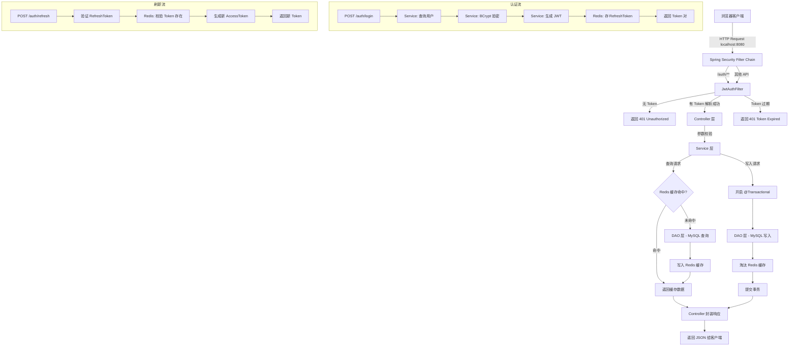

# 极简网页浏览器新标签页 — 后端架构设计文档

> 版本：v1.0 | 最后更新：2026-05-15 | 作者：全栈架构团队

---

## 一、技术栈选型

| 层次 | 技术 | 版本 | 选型理由 |
|------|------|------|---------|
| 运行时 | JDK | 17 LTS | 长期支持版本，生态成熟 |
| 框架 | Spring Boot | 3.x | 企业级微服务框架，自动配置 |
| 安全 | Spring Security | 6.x | 声明式安全控制，与 Spring Boot 深度集成 |
| 认证 | JWT (jjwt) | 0.12.x | 无状态 Token，适合前后端分离 |
| ORM | MyBatis-Plus | 3.5.x | 轻量级 ORM，Lambda 查询 |
| 数据库 | MySQL | 5.7 | 成熟稳定，满足结构化存储需求 |
| 缓存 | Redis | 3.2.100 | 高性能缓存，Token 黑名单 |
| 构建 | Maven | 3.9.x | Java 生态标准构建工具 |
| API文档 | SpringDoc OpenAPI | 2.x | 自动生成 Swagger 文档 |

---

## 二、分层架构设计

### 2.1 架构总览

```
┌─────────────────────────────────────────────────────────┐
│                    Client (Browser)                     │
├─────────────────────────────────────────────────────────┤
│                   Spring Security Filter Chain          │
│              (JWT Auth Filter / CORS / CSRF)            │
├─────────────────────────────────────────────────────────┤
│                   Controller Layer                      │
│       @RestController — 接收 HTTP 请求，参数校验        │
├─────────────────────────────────────────────────────────┤
│                    Service Layer                        │
│     @Service — 业务逻辑编排，事务管理，缓存控制          │
├─────────────────────────────────────────────────────────┤
│                      DAO Layer                          │
│       Mapper 接口 — 数据持久化，SQL 执行                │
├─────────────────────────────────────────────────────────┤
│                  MySQL 5.7  │  Redis 3.2.100                │
│                    (持久化)    (缓存 / Token)            │
└─────────────────────────────────────────────────────────┘
```

### 2.2 各层职责

#### Controller 层（`*.controller`）

| 职责 | 说明 |
|------|------|
| 接收请求 | 处理 HTTP GET/POST/PUT/DELETE |
| 参数校验 | 使用 `@Valid` + Bean Validation 注解 |
| 调用 Service | 将 DTO 传入 Service，返回统一响应体 |
| **不包含** | 业务逻辑、数据库操作 |

```java
@RestController
@RequestMapping("/api/v1/auth")
public class AuthController {

    @PostMapping("/login")
    public Result<LoginRespDTO> login(@Valid @RequestBody LoginDTO dto) {
        return Result.success(authService.login(dto));
    }
}
```

#### Service 层（`*.service`）

| 职责 | 说明 |
|------|------|
| 业务逻辑编排 | 组合多个 DAO 操作完成一个业务 |
| 事务管理 | `@Transactional` 声明事务边界 |
| 缓存控制 | `@Cacheable` / `@CacheEvict` 控制 Redis 缓存 |
| 数据转换 | DTO ↔ Entity 转换 |
| **不包含** | HTTP 请求处理、直接 SQL |

```java
@Service
public class AuthServiceImpl implements AuthService {

    public LoginRespDTO login(LoginDTO dto) {
        // 1. 查用户
        // 2. 验密码
        // 3. 生成 JWT
        // 4. 缓存 Token
    }
}
```

#### DAO 层（`*.mapper`）

| 职责 | 说明 |
|------|------|
| 数据持久化 | 执行 SQL 与数据库交互 |
| 单表 CRUD | MyBatis-Plus BaseMapper 自动提供 |
| 复杂查询 | 自定义 SQL（XML 或注解） |
| **不包含** | 业务逻辑、事务控制 |

```java
@Mapper
public interface UserMapper extends BaseMapper<User> {

    @Select("SELECT * FROM navatation_user WHERE username = #{username}")
    User selectByUsername(String username);
}
```

---

## 三、项目模块结构

```
navatation-server/
├── pom.xml                          # 父 POM，依赖管理
├── navatation-common/               # 公共模块
│   ├── pom.xml
│   └── src/main/java/com/navatation/common/
│       ├── constant/                # 常量定义
│       ├── enums/                   # 枚举类
│       ├── exception/               # 自定义异常
│       ├── dto/                     # 通用 DTO
│       └── util/                    # 工具类
│
├── navatation-framework/            # 框架模块
│   ├── pom.xml
│   └── src/main/java/com/navatation/framework/
│       ├── config/                  # Spring 配置
│       │   ├── SecurityConfig.java  # Spring Security 配置
│       │   ├── RedisConfig.java     # Redis 配置
│       │   └── WebMvcConfig.java    # CORS / 拦截器
│       ├── security/                # 安全组件
│       │   ├── JwtTokenProvider.java
│       │   ├── JwtAuthFilter.java
│       │   └── UserDetailsServiceImpl.java
│       ├── aspect/                  # AOP 切面（日志/限流）
│       └── handler/                 # 全局异常处理
│           └── GlobalExceptionHandler.java
│
└── navatation-business/             # 业务模块
    ├── pom.xml
    └── src/main/java/com/navatation/business/
        ├── controller/              # 接口控制器
        │   ├── AuthController.java
        │   ├── NavController.java
        │   ├── SettingsController.java
        │   └── TodoController.java
        ├── service/                 # 业务服务
        │   ├── AuthService.java
        │   ├── NavService.java
        │   ├── SettingsService.java
        │   └── TodoService.java
        ├── service/impl/            # 服务实现
        ├── mapper/                  # MyBatis Mapper
        │   ├── UserMapper.java
        │   ├── NavCategoryMapper.java
        │   ├── NavShortcutMapper.java
        │   ├── UserConfigMapper.java
        │   └── TodoItemMapper.java
        ├── entity/                  # 数据库实体
        └── vo/                      # 视图对象（返回前端）
```

---

## 四、核心设计

### 4.1 JWT 无状态认证流程

```
1. 用户登录 POST /api/v1/auth/login
2. 服务端校验用户名密码
3. 生成 Access Token (有效期 2h) + Refresh Token (有效期 7d)
4. Access Token 返回给前端存储在 localStorage
5. Refresh Token 存入 Redis (key: refresh_token:{userId})
6. 后续请求在 Header 中携带: Authorization: Bearer <AccessToken>
7. JwtAuthFilter 拦截请求，解析 Token 并设置 SecurityContext
8. Access Token 过期时，前端用 Refresh Token 调用 /auth/refresh 续期
9. 登出时，将 Access Token 加入 Redis 黑名单，删除 Refresh Token
```

### 4.2 Redis 缓存策略

| 缓存对象 | Key 格式 | 过期时间 | 策略 |
|---------|---------|---------|------|
| Refresh Token | `refresh_token:{userId}` | 7天 | 写入 |
| Token 黑名单 | `blacklist:{tokenId}` | Token 剩余有效期 | 写入 |
| 导航分类列表 | `nav:category:{userId}` | 30分钟 | 读时缓存，写时淘汰 |
| 快捷方式列表 | `nav:shortcut:{userId}` | 30分钟 | 读时缓存，写时淘汰 |
| 用户配置 | `config:{userId}` | 30分钟 | 读时缓存，写时淘汰 |
| 推荐分类数据 | `nav:recommended` | 1小时 | 启动时加载，永不淘汰 |
| **接口幂等性防抖** | `sys:idempotent:{userId}:{method}:{uri}:{hash}` | 默认 5秒 | AOP 拦截器写入，`setIfAbsent` 防重复提交 |

### 4.3 统一响应结构

```json
{
  "code": 200,
  "message": "success",
  "data": { ... },
  "timestamp": 1715760000000
}
```

| code | 含义 |
|------|------|
| 200 | 成功 |
| 400 | 参数校验失败 |
| 401 | 未认证 / Token 过期 |
| 403 | 无权限 |
| 404 | 资源不存在 |
| 409 | 数据冲突（如用户名重复） |
| 500 | 服务器内部错误 |

---

## 五、数据流向图



---

## 六、安全设计

| 措施 | 实现 |
|------|------|
| 密码加密 | BCryptPasswordEncoder（强度 10） |
| JWT 签名 | HMAC-SHA256，密钥通过环境变量注入 |
| CORS | 白名单控制允许的来源域名 |
| SQL 注入防护 | MyBatis 参数化查询（#{}） |
| XSS 防护 | 输入校验 + 输出编码 |
| 接口限流 | 登录接口 IP 级别限流（Redis + Lua） |
| 日志脱敏 | 敏感字段（密码、Token）不记录到日志 |
| 传输加密 | RSA-OAEP-256 + 一次性 Nonce，详见 [RSA 加密登录设计](rsa-login-encryption-design.md) |

---

## 七、本地开发环境

### 7.1 环境依赖

本阶段所有服务均在本地启动，无需反向代理。以下组件已预装：

| 组件 | 版本 | 端口 | 说明 |
|------|------|------|------|
| JDK | 17 LTS | — | `JAVA_HOME` 已配置 |
| Maven | 3.9.x | — | 构建与依赖管理 |
| MySQL | 5.7 | 3306 | 执行 `admin/ddl.sql` 初始化库表 |
| Redis | 7.x | 6379 | Token 缓存与黑名单 |

### 7.2 本地启动步骤

```bash
# 1. 初始化数据库（首次）
mysql -u root -p < admin/ddl.sql

# 2. 进入项目根目录
cd navatation-server

# 3. 编译打包
mvn clean package -DskipTests

# 4. 启动应用
mvn spring-boot:run

# 5. 验证
curl http://localhost:8080/api/v1/nav/recommended
```

### 7.3 本地架构拓扑

```
┌──────────────────────────────────────┐
│         浏览器 (localhost:5173)       │
│           Vite Dev Server            │
└──────────────┬───────────────────────┘
               │ HTTP (CORS 白名单)
               ▼
┌──────────────────────────────────────┐
│      Spring Boot (localhost:8080)    │
│  ┌────────────────────────────────┐  │
│  │   Spring Security + JWT Filter │  │
│  ├────────────────────────────────┤  │
│  │   Controller → Service → DAO   │  │
│  └────────────────────────────────┘  │
└──────┬──────────────────┬────────────┘
       │                  │
       ▼                  ▼
┌──────────────┐  ┌──────────────┐
│  MySQL 5.7   │  │  Redis 7.x   │
│  localhost   │  │  localhost   │
│  :3306       │  │  :6379       │
└──────────────┘  └──────────────┘
```

### 7.4 application.yml 关键配置

```yaml
server:
  port: 8080

spring:
  datasource:
    url: jdbc:mysql://localhost:3306/navatation?useSSL=false&characterEncoding=utf8mb4
    username: root
    password: root
  data:
    redis:
      host: localhost
      port: 6379

app:
  jwt:
    secret: ${JWT_SECRET:your-256-bit-secret-key-here}
    access-token-expire: 7200
    refresh-token-expire: 604800
```

> 生产环境部署（Nginx 反向代理、HTTPS、集群化）将在后续迭代中加入。

---

## 八、数据库建表规则

为了规范数据存储结构，增强系统可读性与后期排查维护便利度，数据库建表与业务 ID 设计需遵循以下核心准则：

1. **唯一物理主键 (row_id)**：
   - 所有的表第一个字段必须是 `row_id`，类型为 `BIGINT UNSIGNED AUTO_INCREMENT PRIMARY KEY`。
   - `row_id` 仅作为底层的物理排序与行物理唯一标识，不参与任何业务逻辑。

2. **唯一业务逻辑键 (logical_id)**：
   - 每张表都必须包含一个业务逻辑 ID 字段（例如 `user_id`, `todo_id`, `config_id` 等），类型统一为 `VARCHAR(64) NOT NULL UNIQUE KEY`。
   - 所有在代码层面的关联查询、业务调用及前后端 JSON 交互，必须且只能使用此业务逻辑主键（即禁止直接暴露和使用 `row_id` 物理主键）。

3. **带前缀的 22 位纯数字随机字符串生成规范**：
   - 业务逻辑主键一律采用带指定前缀的 22 位纯数字随机字符串拼接生成。
   - 为了快速在日志、数据库和缓存中排查定位是哪个实体类型发生问题，ID 值的前缀必须满足以下约束：
     - **用户 ID** (`user_id`)：必须带有单字符 **`U`** 前缀，后接 22 位随机纯数字（例如：`U3948502938471029384756`）
     - **用户配置 ID** (`config_id`)：必须带有双字符 **`UC`** 前缀，后接 22 位随机纯数字（例如：`UC5829102938471029384720`）
     - **待办事项 ID** (`todo_id`)：必须带有双字符 **`TD`** 前缀，后接 22 位随机纯数字（例如：`TD2938471029384758291029`）
     - **自定义导航分类 ID** (`category_id`)：带有双字符 **`CG`** 前缀，后接 22 位随机纯数字
     - **自定义快捷网址 ID** (`shortcut_id`)：带有双字符 **`SC`** 前缀，后接 22 位随机纯数字
     - **推荐分类 ID** (`category_id`)：带有双字符 **`RC`** 前缀，后接 22 位随机纯数字
     - **推荐网址 ID** (`site_id`)：带有双字符 **`RS`** 前缀，后接 22 位随机纯数字

---

## 九、核心实体模型设计

### 9.1 用户与权限层 (User & Permission)
*   **User**: 存储用户基本信息、凭据、角色（USER/ADMIN）。`user_id` 逻辑外键用于所有其他业务表。
    *   **权限架构说明**：管理员(`ADMIN`)在系统内不维护私人配置，其所有操作（增删改查首页配置与网址）均会被后端静默拦截并重定向至推荐全局表（`RecommendConfig`, `RecommendCategory`, `RecommendSite`）。普通用户(`USER`)正常读写自己的 `UserConfig` 等表。

### 9.2 配置层 (Configuration)
*   **UserConfig**: 存储普通用户的个性化设置（搜索引擎、主题色、背景图片等）。
*   **RecommendConfig**: 存储系统的全局默认推荐配置（字段结构同 UserConfig）。由 ADMIN 维护，作为游客模式（GuestConfig）的默认下发配置。
*   **UserWidget**: 用户开启的各类组件实例（时钟、待办、日历等），以 JSON `meta` 格式灵活存储配置。

