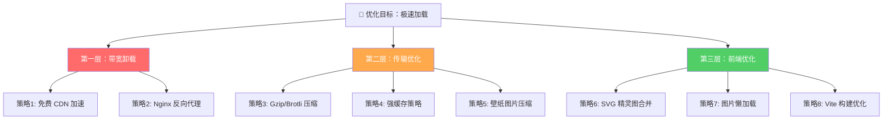

# 1M 带宽服务器静态资源加速优化方案

> 核心目标：在服务器仅有 1M 带宽（≈128KB/s）的硬约束下，通过多层次优化策略，将静态资源加载体验提升到接近 CDN 级别的流畅度。

## 现状诊断

经过对项目全面分析，当前存在以下 **8 大性能瓶颈**：

| # | 问题 | 严重程度 | 影响 |
|:--|:-----|:---------|:-----|
| 1 | **零 CDN** — 所有资源直接从源站加载 | 🔴 致命 | 所有请求挤占 1M 带宽 |
| 2 | **零 HTTP 压缩** — 未配置 Gzip/Brotli | 🔴 致命 | SVG/JS/CSS 原始大小传输 |
| 3 | **零缓存策略** — 文件下载接口无 `Cache-Control` | 🔴 致命 | 每次访问重复下载 |
| 4 | **无 Nginx 代理** — 前后端直接暴露端口 | 🟠 严重 | 失去静态资源优化中间层 |
| 5 | **50+ SVG 独立请求** — 图标逐一加载 | 🟠 严重 | HTTP 请求数过多 |
| 6 | **壁纸无优化** — 高清壁纸原图传输 | 🟠 严重 | 单张壁纸可能 2-5MB |
| 7 | **无懒加载** — 所有图片首屏一次性加载 | 🟡 中等 | 首屏加载时间过长 |
| 8 | **Vite 构建零优化** — 无图片压缩插件 | 🟡 中等 | 打包产物未优化 |

## 优化策略总览（分三个层次）



---

## User Review Required

> [!IMPORTANT]
> **CDN 服务选择**：以下方案推荐使用**免费 CDN**（如 Cloudflare 免费套餐或国内的多吉云/又拍云联盟免费额度），可以将 90%+ 的静态资源流量从源站卸载出去。需要老板确认：
> 1. 项目域名是否已备案？（国内 CDN 需要备案）
> 2. 是否有域名可以用于 CDN 配置？
> 3. 是否接受使用 Cloudflare（国际 CDN，免费无限流量但国内需要走海外节点）？

> [!WARNING]
> **策略 1（CDN 加速）是效果最显著的优化**，能解决 70% 以上的问题。但需要域名 + DNS 配置。如果暂时无法使用 CDN，策略 2-8 仍然能带来显著提升。

## Open Questions

1. **域名与 DNS**：老板目前是否有可用的域名指向服务器 `106.13.107.122`？还是直接通过 IP 访问？
2. **服务器权限**：是否有服务器 SSH 权限可以安装 Nginx？
3. **预算**：是否愿意使用付费 CDN（如阿里云 OSS + CDN），还是倾向于完全免费方案？
4. **壁纸来源**：用户上传的壁纸是否需要保留原图？还是可以在上传时自动压缩？

---

## 第一层：带宽卸载（效果最大 ⭐⭐⭐）

### 策略 1：免费对象存储 + CDN 加速（推荐方案）

**核心思路**：将所有静态资源（图标、壁纸、前端打包产物）迁移到 CDN，源站只承担 API 请求。

**推荐方案对比**：

| 方案 | 免费额度 | 国内速度 | 备案要求 | 推荐指数 |
|:-----|:---------|:---------|:---------|:---------|
| **Cloudflare R2 + CDN** | 10GB 存储 / 无限流量 | ⭐⭐⭐ (国内一般) | 无 | ⭐⭐⭐⭐ |
| **多吉云 CDN** | 每月 10GB 免费流量 | ⭐⭐⭐⭐⭐ | 需备案 | ⭐⭐⭐⭐⭐ |
| **又拍云联盟** | 每月 15GB 免费流量 + 10GB 存储 | ⭐⭐⭐⭐⭐ | 需备案 | ⭐⭐⭐⭐⭐ |
| **阿里云 OSS** | 前 6 个月免费试用 | ⭐⭐⭐⭐⭐ | 需备案 | ⭐⭐⭐ |

**架构变化**：
```
优化前：
Browser → 源站(1M) → [前端JS/CSS + 图标 + 壁纸 + API]

优化后：
Browser → CDN(高速) → [前端JS/CSS + 图标 + 壁纸]  (90%流量)
Browser → 源站(1M) → [API 请求]                     (10%流量)
```

#### 实施方式

##### 方式 A：图床/对象存储模式（改动最小）

后端文件上传服务改为上传到对象存储（如 Cloudflare R2），返回 CDN URL。

##### [MODIFY] [FileServiceImpl.java](file:///e:/workspace/navatation/navatation-admin/navatation-business/src/main/java/com/navatation/business/service/impl/FileServiceImpl.java)
- 新增对象存储上传逻辑（保留本地存储作为 fallback）
- `uploadFile()` 方法上传到对象存储后返回 CDN URL（如 `https://cdn.yoursite.com/icons/xxx.svg`）
- 新增 `application.yml` 配置项：`app.cdn.enabled`, `app.cdn.bucket-name`, `app.cdn.endpoint`

##### 方式 B：前端部署到 CDN（零改动后端）

将前端 `dist/` 打包产物直接部署到 Cloudflare Pages / Vercel / Netlify 等免费平台：
- **Cloudflare Pages**：免费，自动 HTTPS，全球 CDN，每月 500 次构建
- **Vercel**：免费，极速部署，自带 CDN
- **Netlify**：免费 100GB/月带宽

> [!TIP]
> **方式 B 是最快见效的方案**：只需要把前端 `dist/` 目录部署到 Cloudflare Pages，然后改一下 API 地址为后端 IP，就能立刻让前端静态资源走 CDN 高速通道，后端只承担 API 请求。

---

### 策略 2：Nginx 反向代理层

在源站加装 Nginx，作为前后端的统一入口和静态资源优化层。

##### [NEW] `/etc/nginx/conf.d/navatation.conf`
```nginx
server {
    listen 80;
    server_name your-domain.com;

    # Gzip 压缩
    gzip on;
    gzip_types text/css application/javascript image/svg+xml application/json;
    gzip_min_length 1024;
    gzip_comp_level 6;

    # 前端静态文件 — 强缓存
    location / {
        root /www/wwwroot/navatation/web/dist;
        try_files $uri $uri/ /index.html;

        # 带 hash 的文件永久缓存
        location ~* \.(js|css|svg|png|jpg|webp|woff2)$ {
            expires 1y;
            add_header Cache-Control "public, immutable";
        }
    }

    # 后端 API 代理
    location /api/ {
        proxy_pass http://127.0.0.1:8080;
        proxy_set_header Host $host;
    }

    # 用户上传文件 — 长缓存 + 压缩
    location /api/v1/file/download/ {
        alias /www/wwwroot/navatation/data/;
        expires 30d;
        add_header Cache-Control "public";
        gzip_static on;
    }
}
```

---

## 第二层：传输优化（中等效果 ⭐⭐）

### 策略 3：Spring Boot 响应压缩

即使不使用 Nginx，也可以在 Spring Boot 层开启 Gzip 压缩。

##### [MODIFY] [application.yml](file:///e:/workspace/navatation/navatation-admin/navatation-business/src/main/resources/application.yml)
```yaml
server:
  compression:
    enabled: true
    mime-types: application/json,application/javascript,text/css,text/html,image/svg+xml
    min-response-size: 1024
```

**预期效果**：SVG 图标压缩率 60-80%，JSON 响应压缩率 70-90%。

---

### 策略 4：文件下载接口添加强缓存头

##### [MODIFY] [FileController.java](file:///e:/workspace/navatation/navatation-admin/navatation-business/src/main/java/com/navatation/business/controller/FileController.java)
- 在 `downloadFile()` 方法的 `ResponseEntity` 中添加 `Cache-Control` 和 `ETag` 响应头
- 图标文件：`Cache-Control: public, max-age=2592000`（30 天）
- 壁纸文件：`Cache-Control: public, max-age=604800`（7 天）

**预期效果**：回访用户零带宽消耗（全部命中浏览器本地缓存）。

---

### 策略 5：壁纸图片上传时自动压缩

##### [MODIFY] [FileServiceImpl.java](file:///e:/workspace/navatation/navatation-admin/navatation-business/src/main/java/com/navatation/business/service/impl/FileServiceImpl.java)
- 引入 `thumbnailator` 依赖进行图片压缩
- 壁纸上传时自动：
  1. 限制最大分辨率为 1920×1080（超出则等比缩放）
  2. JPEG 质量压缩至 80%
  3. 生成 WebP 格式副本（体积再减 30%）
  4. 生成缩略图（用于设置面板预览）

##### [MODIFY] [pom.xml](file:///e:/workspace/navatation/navatation-admin/navatation-business/pom.xml)
- 新增 `net.coobird:thumbnailator:0.4.20` 依赖

**预期效果**：壁纸从 2-5MB → 200-500KB，缩小 80%+。

---

## 第三层：前端优化（锦上添花 ⭐）

### 策略 6：SVG 图标内联 / 精灵图合并

##### [NEW] 构建脚本：SVG 精灵图生成
- 使用 `vite-plugin-svg-icons` 将 50+ SVG 图标合并为一个精灵图
- 组件中通过 `<use xlinkHref="#icon-name">` 引用
- **HTTP 请求从 50+ 次降至 1 次**

##### [MODIFY] [vite.config.ts](file:///e:/workspace/navatation/navatation-web/vite.config.ts)
- 新增 `vite-plugin-svg-icons` 插件配置
- 配置 `iconDirs` 指向 `src/app/assets/icons`
- 配置 `symbolId` 格式：`icon-[name]`

##### [MODIFY] 引用 SVG 的各组件
- 将 `import xxxIcon from '@/assets/icons/xxx.svg'` 改为使用精灵图组件 `<SvgIcon name="xxx" />`

---

### 策略 7：图片懒加载

##### [NEW] `src/app/hooks/useLazyImage.ts`
- 基于 `IntersectionObserver` 的图片懒加载 Hook
- 图标进入视口前显示骨架占位符
- 加载完成后淡入显示

##### [MODIFY] [ShortcutCard.tsx](file:///e:/workspace/navatation/navatation-web/src/app/components/ShortcutCard.tsx) 等图标组件
- 使用 `useLazyImage` Hook 实现按需加载

---

### 策略 8：Vite 构建优化

##### [MODIFY] [vite.config.ts](file:///e:/workspace/navatation/navatation-web/vite.config.ts)
- 新增 `vite-plugin-compression` 插件（生成 `.gz` 预压缩文件）
- 新增 `vite-plugin-imagemin` 或 `@vite-pwa/assets-generator`（构建时压缩图片）
- 配置 `build.rollupOptions.output.manualChunks` 合理分包

---

## 优先级实施路线图

> [!IMPORTANT]
> 建议按照以下顺序实施，每一步都能**独立产生显著效果**，不依赖其他步骤：

```mermaid
gantt
    title 优化实施路线图
    dateFormat X
    axisFormat %s

    section 第一阶段：立竿见影
    策略3: Spring Boot 压缩        :a1, 0, 1
    策略4: 缓存头                  :a2, 0, 1
    
    section 第二阶段：核心提升
    策略1B: 前端部署到 CDN         :b1, 1, 2
    策略2: Nginx 反向代理          :b2, 1, 2
    
    section 第三阶段：深度优化
    策略5: 壁纸压缩               :c1, 2, 3
    策略6: SVG 精灵图              :c2, 2, 3
    策略7: 懒加载                  :c3, 3, 4
    策略8: Vite 构建优化           :c4, 3, 4
```



| 阶段 | 策略 | 实施难度 | 预期效果 | 耗时 |
|:-----|:-----|:---------|:---------|:-----|
| **第一阶段** | 策略 3 + 4（压缩 + 缓存） | ⭐ 极简 | 回访加载提升 90% | 30 分钟 |
| **第二阶段** | 策略 1B（CDN）+ 策略 2（Nginx） | ⭐⭐ 中等 | 首次加载提升 80% | 2-3 小时 |
| **第三阶段** | 策略 5-8（深度优化） | ⭐⭐⭐ 较高 | 极致优化 | 1-2 天 |

## Verification Plan

### 阶段性验证
- 每个策略实施后，使用浏览器 DevTools Network 面板对比：
  - 资源总大小（传输大小 vs 原始大小）
  - 请求数量
  - 首次加载时间 / 缓存命中率

### 工具辅助
- [Google PageSpeed Insights](https://pagespeed.web.dev/) — 综合评分
- Chrome DevTools > Lighthouse — 性能审计
- Chrome DevTools > Network > Throttle > Slow 3G — 模拟低速网络

### 最终目标
| 指标 | 优化前（估计） | 优化后目标 |
|:-----|:---------------|:-----------|
| 首屏加载时间 | 8-15s | < 2s |
| 首次资源传输量 | 3-10MB | < 500KB |
| 回访资源传输量 | 3-10MB | < 50KB |
| HTTP 请求数 | 60+ | < 15 |
