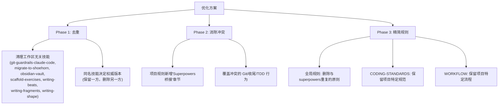

# Superpowers 插件 vs 项目规则：冲突与优化分析报告

> 分析范围：14 个 Superpowers 技能 × 项目三层规则（全局/GEMINI/WORKFLOW/CODING-STANDARDS）× 34+2 个工作区技能

---

## 📋 执行摘要

| 类别 | 数量 | 严重程度 |
|:---|:---:|:---:|
| 🔴 **直接冲突** | 5 | 需立即解决 |
| 🟡 **语义冗余** | 6 | 建议精简 |
| 🟢 **互补增强** | 3 | 保留并桥接 |
| ⚫ **技能重复** | 18 | 需去重决策 |

---

## 🔴 直接冲突（5 个）

### 冲突 1: Git 分支工作流模型不兼容

```
项目规则 (WORKFLOW.md §4)          ←→   Superpowers (3个技能)
─────────────────────────────           ─────────────────────────
dev + main 双分支模型                    Feature-branch + Worktree 模型
日常开发在 dev 分支                       每个任务创建独立 worktree
推送用 push-dev.bat                      finishing-a-development-branch 提供4选项
合并用 merge-to-main.bat                 using-git-worktrees 创建 .worktrees/
```

**涉及技能**: `using-git-worktrees`, `finishing-a-development-branch`, `executing-plans`

**具体冲突点**:
- `using-git-worktrees` 会在项目中创建 `.worktrees/` 目录和 feature 分支，而项目只使用 `dev`/`main`
- `finishing-a-development-branch` 提供"本地合并/推送PR/保持/丢弃"四选项，不了解项目的 `push-dev.bat` 脚本
- `executing-plans` 规定"禁止在 main/master 分支实现"，但项目的日常开发就在 `dev` 上进行（非 feature branch）

**影响**: Superpowers 会试图创建不必要的 worktree 和 feature 分支，破坏项目简洁的双分支流程

> [!CAUTION]
> 这是最严重的冲突。如果不解决，superpowers 会在每次开发任务时试图拉分支和创建 worktree。

---

### 冲突 2: 任务收尾流程冲突

```
项目规则 (WORKFLOW.md §5-6)         ←→   Superpowers (2个技能)
─────────────────────────────           ─────────────────────────
必须 Git 推送 (push-dev.bat)             verification-before-completion 只管验证
必须输出 [METRICS] 统计模块               finishing-a-development-branch 自行管理合并
"静默收尾"禁止脏 Working Tree             两者都不知道 METRICS 要求
```

**涉及技能**: `verification-before-completion`, `finishing-a-development-branch`

**具体冲突点**:
- 项目要求每次任务结束**必须**输出 `[METRICS]` 模块（最高行为红线），superpowers 的收尾流程完全不包含此步骤
- `finishing-a-development-branch` 会接管 Git 操作，绕过项目的 `push-dev.bat` 脚本
- `verification-before-completion` 的 IDENTIFY→RUN→READ→VERIFY→DECLARE 流程没有"推送代码"和"输出度量"的步骤

**影响**: 使用 superpowers 收尾时会遗漏项目强制的 METRICS 输出和指定的 Git 推送脚本

---

### 冲突 3: 文档/计划存储路径不一致

```
项目规则 (项目结构地图)              ←→   Superpowers (2个技能)
─────────────────────────────           ─────────────────────────
doc/plans/          ← 实现计划           docs/superpowers/plans/YYYY-MM-DD-*.md
doc/specs/          ← 设计方案           docs/superpowers/specs/YYYY-MM-DD-*.md
doc/PRD.md          ← 产品需求           (不涉及)
```

**涉及技能**: `brainstorming`, `writing-plans`

**具体冲突点**:
- `brainstorming` 将设计文档存储到 `docs/superpowers/specs/`
- `writing-plans` 将实现计划存储到 `docs/superpowers/plans/`
- 项目已有 `doc/plans/` 和 `doc/specs/` 目录

**影响**: 产生两套并行的文档目录，查找困难，维护混乱

---

### 冲突 4: TDD 强制性程度不匹配

```
项目规则 (CODING-STANDARDS §5)      ←→   Superpowers (test-driven-development)
─────────────────────────────           ─────────────────────────
"编写核心新功能时，优先编写测试"           "铁律：无失败测试不得写生产代码"
TDD 是推荐性的，限于核心功能               TDD 是强制性的，适用于所有代码
允许先写代码后补测试                       "如果先写了代码：删除它"
```

**涉及技能**: `test-driven-development`, `tdd`（工作区版）

**具体冲突点**:
- 项目规则对 TDD 的态度是"推荐"（`优先编写测试用例`），superpowers 的态度是"铁律"（`无失败测试不得写生产代码`）
- 项目允许对非核心功能灵活处理测试顺序，superpowers 要求"如果先写了代码：删除它，不保留作参考"
- 这在日常小修改（如 UI 微调、配置变更、样式调整）上会造成巨大摩擦

**影响**: 对简单修改（如加个 Tailwind class、改个常量值）也强制要求 TDD 流程，严重降低效率

---

### 冲突 5: Brainstorming HARD-GATE vs 日常开发快捷路径

```
项目规则 (WORKFLOW.md §5.1)          ←→   Superpowers (brainstorming)
─────────────────────────────           ─────────────────────────
"任务规划（非强制）"                       "HARD-GATE: 禁止在获得批准前写代码"
"日常开发直接执行即可"                     "任何创作性工作之前必须使用（无例外）"
复杂任务才需要 implementation_plan         即使看起来简单也必须 brainstorm
```

**涉及技能**: `brainstorming`

**具体冲突点**:
- 项目明确允许"日常开发直接执行"，只在"大型模块重构、跨模块设计"时才推荐规划
- Superpowers 的 brainstorming 要求"任何创作性工作之前**必须**使用（无例外，即使看起来很简单）"
- HARD-GATE 会阻止直接修 bug、加小功能等日常操作

**影响**: 每个小任务都被迫走完 brainstorming 8 步检查清单，一个 5 分钟的 bug fix 可能需要 20 分钟的前置讨论

---

## 🟡 语义冗余（6 个）

### 冗余 1: YAGNI 原则多处重复声明

| 来源 | 表述 |
|:---|:---|
| `brainstorming` | "YAGNI 原则严格执行" |
| `test-driven-development` | "GREEN: 不加额外功能" |
| `receiving-code-review` | "YAGNI 检查：先 grep 确认是否使用" |
| `writing-plans` | "无占位符规则" |
| 项目 CODING-STANDARDS | （隐含在精简控制流中） |

**建议**: YAGNI 在全局规则中声明一次即可，技能中引用而非重复定义

---

### 冗余 2: "验证后才能声明完成" 多处重复

| 来源 | 表述 |
|:---|:---|
| `verification-before-completion` | 完整的 IDENTIFY→RUN→READ→VERIFY→DECLARE 流程 |
| `finishing-a-development-branch` | "测试失败不得继续" |
| `systematic-debugging` | "无根因调查不得提出修复" |
| `subagent-driven-development` | 任务审查+全分支审查 |
| 项目 WORKFLOW.md | "静默收尾...严禁在 Working Tree 脏时宣布完成" |

**建议**: `verification-before-completion` 已经是权威定义，项目规则中的相关表述可简化为引用

---

### 冗余 3: 代码质量通用原则重复

| 项目规则表述 | Superpowers 对应 |
|:---|:---|
| "高内聚低耦合" (全局规则) | `codebase-design` 的深模块哲学 |
| "类型安全" (全局规则) | `test-driven-development` 的类型驱动 |
| "防御性编程" (全局规则) | `systematic-debugging` 的红旗思维 |

**建议**: 全局规则保留精简的原则声明，具体执行方法由 superpowers 技能承担

---

### 冗余 4: 文档驱动开发 vs 计划驱动开发

| 项目 WORKFLOW.md §DDD | Superpowers |
|:---|:---|
| 变更时同步更新 PRD、接口协议、DDL 等 | `brainstorming` → `writing-plans` 流程 |

**区分点**: 项目的 DDD 是"维护型"（同步更新已有文档），superpowers 是"创建型"（生成新的设计文档和计划）。两者互补而非冲突，但表述上容易混淆。

**建议**: 项目规则中明确标注"文档同步维护"，与 superpowers 的"设计文档生成"区分

---

### 冗余 5: 调试方法论双轨制

| 工作区 `diagnosing-bugs` | Superpowers `systematic-debugging` |
|:---|:---|
| 6 阶段（反馈循环→复现→假设→检测→修复→清理） | 4 阶段（根因→模式→假设→实现） |
| 10 种构建反馈循环的方法 | 3 次修复失败规则 |
| Phase 1 核心是"构建反馈循环" | 核心是"无根因调查不得提出修复" |

**建议**: 两者理念一致但步骤不同，保留一个即可。`diagnosing-bugs` 更详尽实用，`systematic-debugging` 更简洁严格

---

### 冗余 6: TDD 技能双轨制

| 工作区 `tdd` | Superpowers `test-driven-development` |
|:---|:---|
| 垂直切片 / 追踪弹方法论 | RED-GREEN-REFACTOR 严格循环 |
| "测试应通过公共接口验证行为" | "无失败测试不得写生产代码" |
| 反模式：水平切片 | "如果先写了代码：删除它" |

**建议**: 合并为一个统一的 TDD 指导，工作区版的"垂直切片"理念 + superpowers 版的"铁律"执行力

---

## 🟢 互补增强（3 个）

### 互补 1: 编码标准 + Superpowers 质量守卫

项目的 CODING-STANDARDS.md 定义了**什么**（500 行上限、卫语句、命名规范等），superpowers 的 `verification-before-completion` 和 `systematic-debugging` 保障了**如何执行**。两者是规范与执行的关系。

**建议**: 保留两者，在项目规则中引用 superpowers 作为执行机制

---

### 互补 2: 项目安全红线 + Superpowers 防御性编程

项目的安全红线（禁止硬编码密钥、SQL 注入防护、XSS 防护等）是领域特定的，superpowers 不涉及这些。superpowers 的 `receiving-code-review` 提供了审查这些规则是否被遵守的机制。

**建议**: 安全红线保留在项目规则中，superpowers 审查流程可以参考这些红线

---

### 互补 3: 服务管理指南 + CodeGraph 索引

项目特有的服务管理（Redis/BE/FE 启停）和 CodeGraph 配置完全不在 superpowers 范围内。这些是纯项目级基础设施。

**建议**: 完全保留在项目规则中，superpowers 不需要感知

---

## ⚫ 技能重复问题（18 个同名/近似技能）

工作区 `.agents/skills/` 和 superpowers `plugins/superpowers/skills/` 之间存在 **18 个重叠技能**：

### 完全同名重叠（15 个）

| 技能名 | 工作区来源 | 与本项目相关性 |
|:---|:---|:---:|
| `codebase-design` | Matt Pocock 系列 | ⭐ 高 |
| `design-an-interface` | Matt Pocock 系列 | ⭐ 中 |
| `domain-modeling` | Matt Pocock 系列 | ⭐ 低 |
| `git-guardrails-claude-code` | Matt Pocock 系列 | ❌ 不适用（Claude Code 专用） |
| `grilling` | Matt Pocock 系列 | ⭐ 中 |
| `migrate-to-shoehorn` | Matt Pocock 系列 | ❌ 不适用（TypeScript 专用库） |
| `obsidian-vault` | Matt Pocock 系列 | ❌ 不适用 |
| `qa` | Matt Pocock 系列 | ⭐ 中 |
| `request-refactor-plan` | Matt Pocock 系列 | ⭐ 中 |
| `resolving-merge-conflicts` | Matt Pocock 系列 | ⭐ 高 |
| `scaffold-exercises` | Matt Pocock 系列 | ❌ 不适用（教学专用） |
| `setup-pre-commit` | Matt Pocock 系列 | ⭐ 低 |
| `tdd` | Matt Pocock 系列 | ⭐ 高 |
| `writing-beats` | Matt Pocock 系列 | ❌ 不适用 |
| `writing-fragments` | Matt Pocock 系列 | ❌ 不适用 |
| `writing-shape` | Matt Pocock 系列 | ❌ 不适用 |

### 近似重叠（3 个）

| 工作区技能 | Superpowers 技能 | 差异 |
|:---|:---|:---|
| `diagnosing-bugs` | `systematic-debugging` | 6阶段 vs 4阶段 |
| `tdd` | `test-driven-development` | 垂直切片 vs RED-GREEN-REFACTOR |
| `writing-great-skills` | `writing-skills` | 技能写作理论 vs TDD 应用于技能 |
| `review` | `requesting-code-review` | 2轴审查 vs 子代理审查 |

> [!WARNING]
> 18 个重复技能意味着每次对话启动时，系统需要加载和比对大量冗余的技能描述，增加了 Token 消耗和匹配歧义。同名技能在触发时可能随机选择版本，导致行为不一致。

---

## 🛠️ 优化建议方案

### 方案概览



---

### Phase 1: 去重 — 清理工作区技能

#### 建议删除的工作区技能（与本项目无关）

| 技能 | 删除理由 |
|:---|:---|
| `git-guardrails-claude-code` | Claude Code 专用，本项目使用 Antigravity |
| `migrate-to-shoehorn` | @total-typescript/shoehorn 专用，本项目不使用 |
| `obsidian-vault` | 个人知识管理工具，与项目开发无关 |
| `scaffold-exercises` | 教学课程专用，本项目是浏览器新标签页 |
| `writing-beats` | 写作技能，与编码无关 |
| `writing-fragments` | 写作技能，与编码无关 |
| `writing-shape` | 写作技能，与编码无关 |
| `edit-article` | 写作技能，与编码无关 |
| `teach` | 教学技能，与项目开发无关 |
| `ubiquitous-language` | 与 `domain-modeling` 功能重叠 |
| `handoff` | 会话移交，Antigravity 有原生机制 |
| `setup-matt-pocock-skills` | Matt Pocock 技能集前置配置，清理后不再需要 |

#### 建议保留的工作区独有技能

| 技能 | 保留理由 |
|:---|:---|
| `ask-matt` | 技能路由器，可重命名适配 |
| `codebase-design` | 深模块设计词汇表，实用 |
| `decision-mapping` | 独有的决策地图能力 |
| `design-an-interface` | 并行接口设计能力 |
| `diagnosing-bugs` | 比 superpowers 版更详尽 |
| `grill-me` / `grill-with-docs` | 快捷面试入口 |
| `grilling` | 核心面试能力 |
| `implement` | 实际实现指导 |
| `improve-codebase-architecture` | 架构改善扫描 |
| `prototype` | 原型构建能力 |
| `qa` | QA 会话 + GitHub Issues |
| `request-refactor-plan` | 重构规划 |
| `resolving-merge-conflicts` | 冲突解决 |
| `review` | 两轴审查（与 superpowers 互补） |
| `tdd` | 垂直切片 TDD（与 superpowers 互补） |
| `to-issues` / `to-prd` / `triage` | Issue 管理流程 |
| `react-best-practices.md` | 前端最佳实践（项目相关） |
| `web-design-guidelines.md` | UI 设计指南（项目相关） |

---

### Phase 2: 消除冲突 — 项目规则桥接

在项目规则中新增一个"Superpowers 适配"章节，用项目级约束**覆盖**冲突的 superpowers 行为：

#### 建议在 WORKFLOW.md 中新增的内容

```markdown
## 🔌 Superpowers 插件适配规则

### Git 工作流适配
- **覆盖 `using-git-worktrees`**: 本项目**不使用** worktree 模型。所有开发在 `dev` 分支进行，禁止创建 `.worktrees/` 目录或 feature 分支。
- **覆盖 `finishing-a-development-branch`**: 任务完成后直接使用 `scripts/git/push-dev.bat` 推送，不走 superpowers 的 4 选项流程。
- **覆盖 `executing-plans` 分支规则**: 本项目的 `dev` 分支等同于 superpowers 语境中的"开发分支"，直接在 `dev` 上实现是正确行为。

### 收尾流程适配
- **扩展 `verification-before-completion`**: 在 superpowers 的 DECLARE 步骤之后，追加两个项目强制步骤：
  1. Git 推送（`push-dev.bat` 或 `merge-to-main.bat`）
  2. 输出 `[METRICS]` 统计模块

### 文档路径适配
- **覆盖 `brainstorming` 和 `writing-plans` 的存储路径**:
  - 设计文档 → `doc/specs/` （而非 `docs/superpowers/specs/`）
  - 实现计划 → `doc/plans/` （而非 `docs/superpowers/plans/`）

### TDD 强制性适配
- **调整 `test-driven-development` 执行力度**: 
  - 核心业务逻辑（Service 层、数据处理）：严格 TDD
  - UI 组件、配置变更、样式调整：允许先实现后补测试
  - 一行修改（常量、命名、样式类）：免除 TDD 要求

### Brainstorming 适配
- **调整 HARD-GATE 触发条件**:
  - 新功能开发、架构变更、跨模块重构：强制 brainstorming
  - Bug 修复、小功能调整、配置变更：跳过 brainstorming，直接执行
```

---

### Phase 3: 精简规则

#### 全局规则（`user_global`）精简建议

当前全局规则与 superpowers 的重叠点：

| 当前规则 | 建议 | 理由 |
|:---|:---|:---|
| "高内聚低耦合、类型安全、易维护的生产级代码" | ✅ 保留 | 是原则性声明，superpowers 是执行手段 |
| "检索并确认全局上下文" | ✅ 保留 | CodeGraph 特有，superpowers 不涉及 |
| "面对模糊需求时暂停执行" | 🔄 可精简 | 与 brainstorming HARD-GATE 部分重叠，但全局规则更宽泛 |
| CodeGraph 指令 | ✅ 保留 | 项目特有基础设施 |

> [!TIP]
> 全局规则当前已经很精简，无需大幅修改。主要保持与 superpowers 的"优先级声明"一致：**用户指令 > 项目规则 > Superpowers 技能 > 默认系统提示**

#### CODING-STANDARDS.md 精简建议

| 当前章节 | 建议 | 理由 |
|:---|:---|:---|
| §1 编码通用红线 | ✅ 全部保留 | 项目特定（500行限制、卫语句、命名规范），superpowers 不涉及 |
| §2 前端编码规范 | ✅ 全部保留 | 项目特定（Tailwind-only、禁止 any、api-client 封装） |
| §3 后端编码规范 | ✅ 全部保留 | 项目特定（Service 层约束、MyBatis `#{}` 等） |
| §4 通用安全红线 | ✅ 全部保留 | 安全规范，superpowers 不涉及 |
| §5 TDD 部分 | 🔄 需修改 | 与 superpowers TDD 冲突，需明确适配层级（见 Phase 2） |

#### WORKFLOW.md 精简建议

| 当前章节 | 建议 | 理由 |
|:---|:---|:---|
| §DDD 文档驱动 | ✅ 保留 | 项目特有的文档同步维护清单 |
| §构建运行 | ✅ 保留 | 项目特有的服务管理 |
| §分支管理 | 🔄 需追加适配说明 | 与 superpowers Git 工作流冲突 |
| §收尾闭环 | 🔄 需追加适配说明 | 与 superpowers 收尾流程冲突 |
| §METRICS | ✅ 保留 | 项目特有强制要求 |
| §agy 配置 | ✅ 保留 | 平台特有配置 |

---

## 📊 优先级行动清单

| 优先级 | 行动 | 预估工作量 |
|:---:|:---|:---:|
| **P0** | 在 WORKFLOW.md 新增"Superpowers 适配规则"章节 | 15 分钟 |
| **P0** | 修改 CODING-STANDARDS.md §5 的 TDD 描述，明确分级 | 5 分钟 |
| **P1** | 清理 12 个与项目无关的工作区技能 | 10 分钟 |
| **P2** | 全局规则微调（可选） | 5 分钟 |

---

## 🤔 需要老板决策的问题

1. **调试技能保留哪个？** 工作区的 `diagnosing-bugs`（6阶段，更详尽）vs superpowers 的 `systematic-debugging`（4阶段，更严格）？还是两者共存？

2. **TDD 分级标准是否合理？** 我建议的"核心业务严格TDD / UI允许后补 / 一行修改免除"是否符合你的期望？

3. **是否同意清理列出的 12 个无关工作区技能？** 或者有些你想保留的？

4. **Brainstorming 豁免范围？** 除了 bug 修复和小调整，是否还有其他场景应该跳过 brainstorming HARD-GATE？

5. **工作区技能来源（Matt Pocock 系列）是否要整体评估？** 这些技能似乎来自另一个开发者的技能集，部分与本项目的技术栈和工作流不完全匹配。
